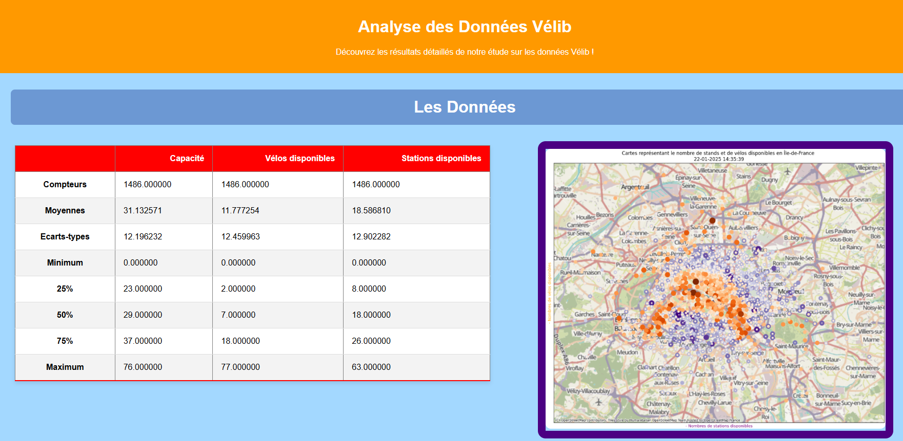

# Traitement données Vélib

Projet réalisé dans le cadre de ma première année de BUT Réseaux & Télécommunications (SAE15).

L’objectif du projet était de traiter des données issues d’un système d’information (ici les données Vélib), puis de les exploiter pour en extraire des informations utiles et les présenter de manière claire.

Le projet simule une situation professionnelle où l’on doit automatiser le traitement de données pour les rendre exploitables par des collaborateurs (services techniques, direction, etc.).

Les données sont récupérées via l’API Vélib, puis traitées avec Python (pandas).  
Certaines données sont aussi utilisées pour faire des visualisations, notamment avec geopandas.

On calcule par exemple :
- la disponibilité des vélos
- la disponibilité des bornes
- différentes statistiques sur les stations

Les résultats peuvent être exportés en HTML pour générer une page web.

## Fichiers
- notebooks : étapes du projet
- python : fonctions
- json : données
- html/css : affichage

## Aperçu

